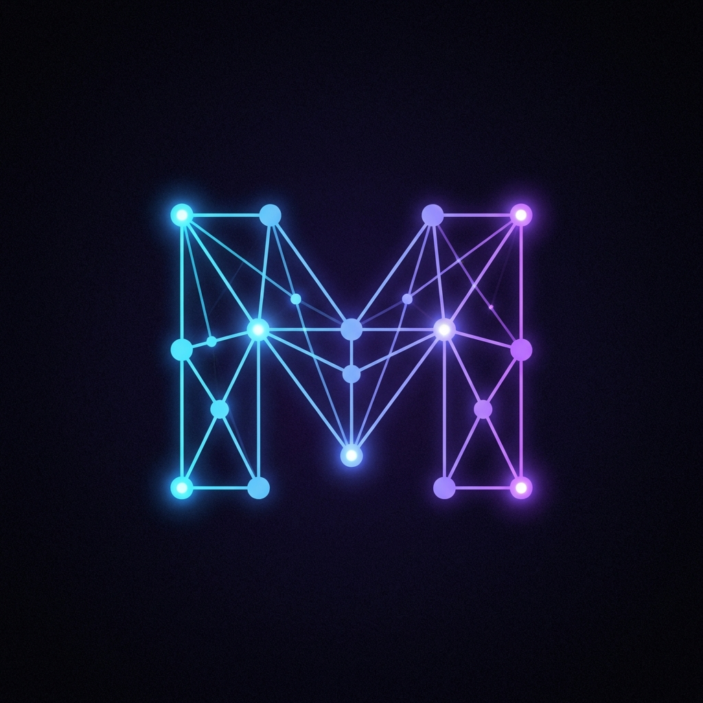

<div align="center">
  
  <h1>Metricverse</h1>
  <p>
    <strong>The Ultimate GitHub Profile Metrics Generator</strong>
  </p>
  <p>
    <a href="#features">Features</a> •
    <a href="#getting-started">Getting Started</a> •
    <a href="#categories">Categories</a> •
    <a href="#license">License</a>
  </p>
  
  <br />
  
  <p align="center">
    
    
    
    
  </p>
</div>

---

## 🚀 Overview

**Metricverse** is a state-of-the-art metrics generator designed to transform your GitHub profile into a premium portfolio. Unlike standard analytic tools, Metricverse focuses on **visual excellence**, **gamification**, and **diverse themes**.

Whether you want a cyberpunk terminal, an 8-bit game analysis, or a sleek corporate infographic, Metricverse has a widget for you.

## ✨ Features

- **90+ Unique Metrics**: From professional graphs to animated pixel art.
- **Client-Side Generation**: Privacy-first. No data storage.
- **Instant Preview**: See your metrics live before using them.
- **Theme Support**: Dark mode default with neon accents.
- **One-Click Copy**: Easily grab the SVG code for your README.

## 🎨 Categories

### 🧠 Intelligence

Analysis and professional data visualization.

- _Bento Grids_
- _Isometric Boxes_
- _Skill Gauges_
- _Project Timelines_

### ⚡ Motion

Animated widgets that bring life to your profile.

- _Matrix Rain_
- _Tech Spheres_
- _Glitch Text_
- _Dev Console_

### 🎮 Gamified

Turn your stats into a game.

- _Tetris Blocks_
- _Pixel Avatar Dance_
- _RPG Status Bars_
- _Achievement Badges_

### 🖼️ Banners & Themes

Hero sections and aesthetic headers.

- _Neon City_
- _Glassmorphism_
- _Retro Vaporwave_

## 🛠️ Getting Started

To run Metricverse locally and explore the library:

1.  **Clone the repository**

    ```bash
    git clone https://github.com/bhanupratapsaini/metricverse.git
    cd metricverse
    ```

2.  **Install dependencies**

    ```bash
    npm install
    ```

3.  **Run the development server**

    ```bash
    npm run dev
    ```

4.  **Open your browser**
    Navigate to `http://localhost:3000` to start generating metrics.

## 📦 Tech Stack

- **Framework**: React 19 + Vite
- **Styling**: Tailwind CSS v4 (via Vite plugin) + Custom CSS
- **Typing**: TypeScript
- **Icons**: Custom SVG Generation Engine

## 📄 License

MIT License © 2026 Metricverse

---

<p align="center">
  <i>Crafted with ❤️ for the Developer Community.</i>
</p>
